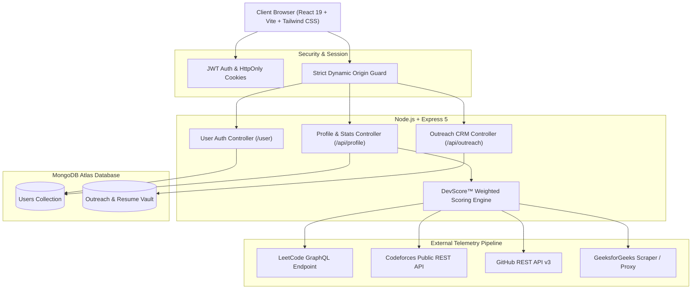

# DevDash — Developer Portfolio & Career Command Center 🚀

[](https://vitejs.dev/)
[](https://react.dev/)
[](https://expressjs.com/)
[](https://www.mongodb.com/)
[](LICENSE)

> **DevDash** is an all-in-one developer identity, live telemetry aggregator, and career outreach platform. It syncs real-time statistics across LeetCode, GitHub, and Codeforces, calculates a dynamic **DevScore™**, generates targeted ATS application pitches, and empowers developers with an integrated HR outreach CRM and public portfolio showcase (`/u/:username`).

---

## 🏛️ System Architecture



---

## ✨ Key Features & Engineering Highlights

### 1. ⚡ Multi-Platform Telemetry Sync & DevScore™
- **LeetCode Integration**: Queries the official LeetCode GraphQL endpoint (`matchedUser`) for real-time problem difficulty breakdown (Easy, Medium, Hard) and global rank.
- **GitHub Ingestion**: Fetches public repositories, follower counts, and contribution cadence directly via GitHub REST APIs.
- **Codeforces Sync**: Retrieves live competition rating, rank, and peak rating via Codeforces REST API.
- **Dynamic DevScore™**: Transparent, multi-axial formula (0 to 2,500) weighting algorithmic mastery, open-source shipping velocity, and competition rating.
- **Dynamic Radar Matrix**: Real-time 6-axis capability graph (DSA, System Design, Full Stack, Git Velocity, Code Reliability, Cloud/DevOps) calculated directly from real data.

### 2. 🎯 ATS Matcher & Cold Outreach Pitch Generator
- Analyzes candidate skill tags against real job descriptions.
- Calculates an instant ATS match percentage and identifies missing keywords.
- Generates tailored, production-ready recruiter pitches and exports ATS-friendly PDF resumes.

### 3. 📬 HR Outreach CRM & Resume Vault
- Direct recruiter cold email composer with customizable templates.
- Built-in Resume Vault to upload and attach distinct resumes per role.
- Pipeline status tracker: Applied → Replied → Interviewing → Offered / Rejected.
- Optional Gmail integration for syncing application responses.

### 4. 🌐 Public Developer Showcase (`/u/:username`)
- Shareable, recruiter-friendly developer showcase page.
- Clean typography, dark mode glassmorphism, verified platform badges, and live project demos.
- Perfect for linking in resumes, LinkedIn profiles, and GitHub readmes.

### 5. 💻 Interactive Developer Terminal (`~`) & Command Palette (`Ctrl+K`)
- Floating retro-modern terminal supporting commands: `whoami`, `skills`, `projects`, `stats`, `arch`, `sudo hire`.
- Command palette for instant navigation across all modules.

---

## 🛠️ Technology Stack

| Layer | Technology |
| :--- | :--- |
| **Frontend** | React 19, Vite, Tailwind CSS, Lucide React, Recharts, Framer Motion |
| **Backend** | Node.js, Express.js 5.x, JWT, Bcrypt, Cookie-Parser, CORS |
| **Database** | MongoDB Atlas with Mongoose ODM |
| **Networking & APIs** | Axios, LeetCode GraphQL, GitHub API v3, Codeforces API, Nodemailer, IMAPFlow |

---

## 🚀 Getting Started Locally

### Prerequisites
- **Node.js**: v18.0.0 or higher
- **npm**: v9.0.0 or higher
- **MongoDB**: Local MongoDB instance or free [MongoDB Atlas](https://www.mongodb.com/cloud/atlas) cluster URI.

### 1. Clone the Repository
```bash
git clone https://github.com/Abhi-247/DevDash.git
cd DevDash
```

### 2. Backend Setup
```bash
cd backend
npm install
```

Create a `.env` file in `backend/`:
```env
PORT=4000
MONGO_URI=mongodb+srv://<username>:<password>@cluster.mongodb.net/devdash?retryWrites=true&w=majority
JWT_KEY=your_super_secret_jwt_key_32_characters_long
CLIENT_URL=http://localhost:5173

# Optional: For HR Outreach Email Sending
SMTP_USER=your_email@gmail.com
SMTP_PASS=your_gmail_16_digit_app_password
```

Start the backend server:
```bash
npm run dev
```

### 3. Frontend Setup
In a new terminal:
```bash
cd frontend
npm install
```

Create a `.env` file in `frontend/`:
```env
VITE_API_URL=http://localhost:4000
```

Start the Vite development server:
```bash
npm run dev
```
Open **http://localhost:5173** in your browser.

---

## 📡 API Reference Overview

### User Authentication (`/user`)
| Method | Endpoint | Description | Auth Required |
| :--- | :--- | :--- | :--- |
| `POST` | `/user/signup` | Register new user & set auth cookie | No |
| `POST` | `/user/login` | Log in user with credentials | No |
| `POST` | `/user/logout` | Clear auth cookie | No |

### Profile & Telemetry (`/api/profile`)
| Method | Endpoint | Description | Auth Required |
| :--- | :--- | :--- | :--- |
| `GET` | `/api/profile/public/:username` | Fetch public portfolio showcase | No |
| `GET` | `/api/profile/profile` | Get authenticated user profile | Yes (JWT) |
| `PUT` | `/api/profile/profile` | Update bio, location, skills, website | Yes (JWT) |
| `POST` | `/api/profile/connect-profile` | Connect LeetCode/GitHub/CF handle | Yes (JWT) |
| `POST` | `/api/profile/sync-stats` | Scrape live platform stats & compute DevScore | Yes (JWT) |
| `POST` | `/api/profile/projects` | Add project with live demo & github links | Yes (JWT) |
| `PUT` | `/api/profile/projects/:id` | Update project details | Yes (JWT) |
| `DELETE`| `/api/profile/projects/:id` | Remove project | Yes (JWT) |

### HR Outreach CRM (`/api/outreach`)
| Method | Endpoint | Description | Auth Required |
| :--- | :--- | :--- | :--- |
| `POST` | `/api/outreach/send` | Send cold application email & save record | Yes (JWT) |
| `GET` | `/api/outreach/history` | Retrieve user's application tracker history | Yes (JWT) |
| `PUT` | `/api/outreach/history/:id/status` | Update pipeline stage (interview, offer, etc.) | Yes (JWT) |
| `GET` | `/api/outreach/resumes` | List uploaded resumes in Vault | Yes (JWT) |
| `POST` | `/api/outreach/resumes` | Upload resume file to Vault | Yes (JWT) |

---

## 🔒 Security & Best Practices
- **Password Security**: Passwords hashed with `bcrypt` salt rounds before storage.
- **JWT Protection**: Tokens transmitted via secure, HttpOnly cookies with optional Bearer fallback.
- **Input Sanitization**: Request bodies validated against schema models before database execution.
- **CORS Protection**: Dynamic whitelist restricting access strictly to configured domain origins.

---

## 📄 License
This project is open-source and available under the [MIT License](LICENSE).
